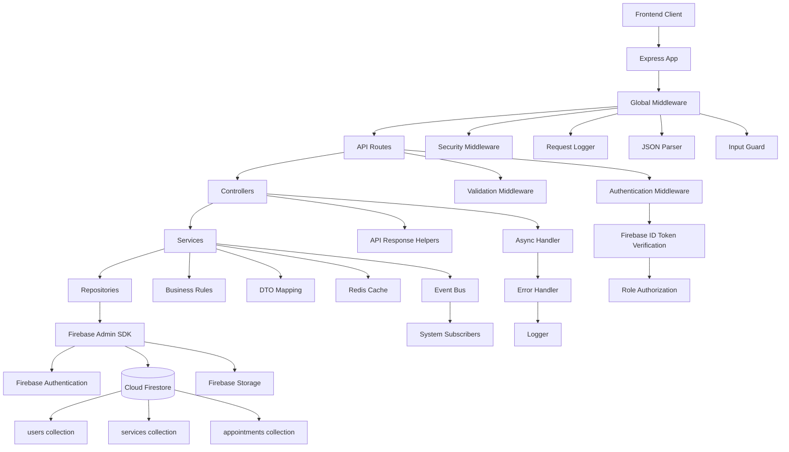
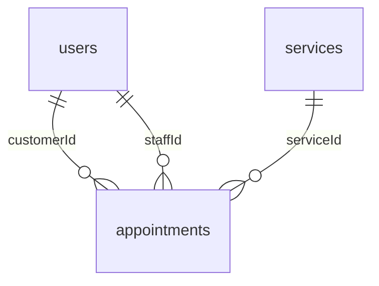

# Kiến trúc Backend Spa Booking với Firebase

## 1. Tên dự án

**Spa Booking Backend** là một API Node.js và Express cho ứng dụng đặt lịch spa.
Trong đồ án này, backend sử dụng **Firebase** làm nền tảng chính, gồm Firebase
Authentication để xác thực người dùng, Cloud Firestore để lưu dữ liệu nghiệp vụ
và Firebase Admin SDK để backend thao tác với Firebase một cách bảo mật.

Backend hỗ trợ đăng ký, xác thực token, quản lý người dùng, quản lý dịch vụ spa,
tạo/hủy/cập nhật lịch hẹn, kiểm tra trạng thái hệ thống, validation, logging,
caching và phân quyền theo role.

## 2. Tổng quan kiến trúc Backend

Backend được xây dựng theo kiến trúc phân lớp:

```text
Client -> Express App -> API Routes -> Controllers -> Services -> Repositories -> Firebase Admin SDK -> Firebase
```

Ứng dụng bắt đầu từ `src/server.js`, tạo HTTP server và nạp Express app từ
`src/app.js`. Express app đăng ký middleware toàn cục trước khi đi vào API
routes, ví dụ: request logging, security middleware, JSON parser, input guard,
compression và static file serving.

Trong kiến trúc Firebase của đồ án, các lớp chính gồm:

- `src/routes/*`: định nghĩa endpoint API.
- `src/controllers/*`: nhận request, gọi service và trả response.
- `src/services/*`: xử lý business logic.
- `src/repositories/*`: truy cập Cloud Firestore thông qua `BaseRepository`.
- `src/config/firebase.js`: khởi tạo Firebase Admin SDK, Firebase Auth,
  Firestore và Storage.
- `firestore.rules`: định nghĩa rule bảo mật cho Firestore.
- `firestore.indexes.json`: định nghĩa index phục vụ query Firestore.

Trong báo cáo này, kiến trúc được trình bày theo đúng hướng Firebase của đồ án:
lớp `routes/controllers/services/repositories` làm việc với
`src/config/firebase.js`, Firebase Authentication và Cloud Firestore.

## 3. Các thành phần chính

| Thành phần | Vị trí | Trách nhiệm |
| --- | --- | --- |
| Server bootstrap | `src/server.js` | Khởi chạy HTTP server và xử lý shutdown. |
| Express app | `src/app.js` | Đăng ký middleware toàn cục, static assets, API routes, 404 handler và error handler. |
| API routes | `src/routes/*.routes.js` | Định nghĩa các endpoint như auth, users, services, appointments, pipeline và health. |
| Controllers | `src/controllers/*.controller.js` | Nhận request, gọi service tương ứng và trả JSON response chuẩn hóa. |
| Services | `src/services/*.service.js` | Xử lý business logic như đăng ký tài khoản, kiểm tra lịch hẹn, phân quyền và cache dịch vụ. |
| Repositories | `src/repositories/*.repository.js` | Đọc/ghi dữ liệu Cloud Firestore thông qua Firebase Admin SDK. |
| Base repository | `src/repositories/base.repository.js` | Cung cấp các hàm chung: `create`, `findById`, `update`, `delete`, `list`. |
| Firebase config | `src/config/firebase.js` | Khởi tạo Firebase app, Auth, Firestore, Storage, service account và emulator config. |
| Authentication | `src/middlewares/auth.middleware.js` | Xác minh Firebase ID token, gắn user vào `req.user` và kiểm tra role. |
| Validation | `src/middlewares/validate.middleware.js`, `src/validators/*` | Validate body, params và query trước khi vào controller. |
| Security middleware | `src/middlewares/security.middleware.js` | Cấu hình Helmet, CORS, rate limit, HPP và sanitize request. |
| Error handling | `src/middlewares/error.middleware.js` | Chuẩn hóa lỗi API, ghi log lỗi và emit system event khi có lỗi server. |
| Logging | `src/utils/logger.js` | Ghi log request, lỗi và sự kiện hệ thống. |
| Cache | `src/services/cache.service.js`, `src/config/redis.js` | Cache dữ liệu đọc nhiều, ví dụ danh sách services. |
| Events | `src/events/*` | Emit/subscriber các sự kiện như tạo appointment, đổi trạng thái appointment và system error. |
| Firestore rules | `firestore.rules` | Kiểm soát quyền đọc/ghi trực tiếp trên Firestore. |
| Firestore indexes | `firestore.indexes.json` | Tối ưu các query theo `services` và `appointments`. |

## 4. Sơ đồ kiến trúc



## 5. Bảng trách nhiệm module

| Module | Routes chính | Trách nhiệm | Firebase/Collection sử dụng |
| --- | --- | --- | --- |
| Health | `GET /health` | Kiểm tra API còn hoạt động. | Không ghi dữ liệu |
| Auth | `POST /auth/register`, `GET /auth/me` | Tạo tài khoản bằng Firebase Auth, gán custom claims và tạo profile người dùng. | Firebase Auth, `users` |
| Users | `GET /users/me`, `PATCH /users/me`, `POST /users/me/avatar`, `GET /users`, `PATCH /users/:uid/role` | Quản lý hồ sơ người dùng, upload avatar và phân quyền admin/customer/staff. | Firebase Auth, `users`, static upload |
| Services | `GET /services`, `GET /services/:id`, `POST /services`, `PATCH /services/:id`, `DELETE /services/:id` | Hiển thị, tạo, sửa và soft delete dịch vụ spa. | `services`, Redis cache |
| Appointments | `GET /appointments`, `POST /appointments`, `GET /appointments/:id`, `PATCH /appointments/:id/cancel`, `PATCH /appointments/:id/status` | Tạo lịch hẹn, xem lịch theo customer/staff/admin, hủy lịch và đổi trạng thái lịch hẹn. | `appointments`, `services` |
| Pipeline | `POST /pipeline/customers/import` | Import customer, validate dữ liệu và xử lý record lỗi. | Firestore/DLQ tùy luồng pipeline |
| Firebase Rules | Không phải API route | Bảo vệ collection khi truy cập Firestore. | `users`, `services`, `appointments` |
| Firebase Indexes | Không phải API route | Hỗ trợ query có điều kiện và sắp xếp trong Firestore. | `services`, `appointments` |

## 6. Luồng request/response

### Luồng request bình thường

1. Frontend gửi request tới backend API.
2. Express app áp dụng middleware toàn cục như security, body parser, sanitize,
   request logging và compression.
3. Request đi vào route tương ứng trong `src/routes/*`.
4. Route chạy middleware cần thiết:
   `validate(...)`, `authenticate` hoặc `authorizeRoles(...)`.
5. Controller nhận request đã được validate và user đã xác thực nếu endpoint cần
   đăng nhập.
6. Controller gọi service layer.
7. Service xử lý business logic. Ví dụ:
   kiểm tra thời gian đặt lịch phải ở tương lai, kiểm tra service còn active,
   kiểm tra staff có bị trùng lịch hay không, hoặc kiểm tra quyền admin/staff.
8. Repository dùng Firebase Admin SDK để đọc/ghi dữ liệu vào Cloud Firestore.
9. Controller trả response JSON chuẩn hóa về frontend.

### Luồng xác thực Firebase

1. Frontend đăng nhập hoặc lấy Firebase ID token từ Firebase Authentication.
2. Frontend gửi request kèm header:

   ```text
   Authorization: Bearer <firebase_id_token>
   ```

3. Middleware `authenticate` lấy bearer token từ header.
4. Backend gọi `getAuth().verifyIdToken(token)` để xác minh token bằng Firebase
   Admin SDK.
5. Sau khi token hợp lệ, backend load profile trong collection `users`.
6. Backend gắn thông tin người dùng vào `req.user`, gồm `uid`, `email`, `role` và
   `profile`.
7. Các endpoint cần phân quyền gọi `authorizeRoles(...)` để kiểm tra role như
   `admin`, `staff` hoặc `customer`.

### Luồng tạo appointment

1. Customer gửi request `POST /appointments`.
2. Route kiểm tra đăng nhập bằng `authenticate` và validate payload bằng
   `createAppointmentSchema`.
3. `appointment.controller.js` gọi `appointment.service.js`.
4. Service kiểm tra `startAt` phải là thời gian tương lai.
5. Service kiểm tra `serviceId` có tồn tại và service đang active trong
   collection `services`.
6. Repository tạo document mới trong collection `appointments`.
7. Nếu có `staffId`, repository dùng Firestore transaction để kiểm tra staff đã
   có lịch ở cùng `startAt` hay chưa.
8. Nếu không trùng lịch, transaction ghi appointment mới.
9. Event `APPOINTMENT_CREATED` được emit để các subscriber có thể xử lý tiếp.
10. Controller trả appointment DTO về frontend.

### Luồng xử lý lỗi

1. Lỗi validation, lỗi xác thực, lỗi phân quyền, lỗi business rule hoặc exception
   ngoài dự kiến được truyền vào `errorHandler`.
2. Error handler tạo JSON response thống nhất, gồm `success: false` và
   `message`.
3. Trong môi trường không phải production, response có thể kèm stack trace để dễ
   debug.
4. Lỗi được ghi log bằng logger.
5. Nếu lỗi là lỗi server từ `500` trở lên, backend emit event `SYSTEM_ERROR`.

## 7. Giải thích tương tác Firebase/Firestore

Backend sử dụng Firebase Admin SDK để thao tác với Firebase ở phía server.
File `src/config/firebase.js` chịu trách nhiệm:

- Đọc service account từ file `.secrets/firebase-service-account.json` hoặc biến
  môi trường.
- Khởi tạo Firebase app bằng `initializeApp`.
- Cung cấp `getAuth()` để thao tác với Firebase Authentication.
- Cung cấp `getFirestore()` để truy cập Cloud Firestore.
- Cung cấp `getStorage()` để dùng Firebase Storage nếu cần.
- Cấu hình Firestore/Auth emulator khi bật chế độ emulator.

### Các collection chính

| Collection | Mục đích | Ghi chú |
| --- | --- | --- |
| `users` | Lưu profile người dùng, email, display name, phone, photoURL và role. | Document id thường là Firebase `uid`. |
| `services` | Lưu dịch vụ spa, category, giá, thời lượng, trạng thái active/popular. | Có query theo category, isActive, createdAt. |
| `appointments` | Lưu lịch hẹn spa của customer với service/staff, thời gian và trạng thái. | Có query theo customerId, staffId, startAt và status. |
| DLQ/Pipeline records | Lưu record import lỗi nếu pipeline cần xử lý sau. | Dùng cho luồng import dữ liệu. |

### Firestore rules

File `firestore.rules` định nghĩa quyền truy cập chính:

- `users`: người dùng chỉ được đọc/cập nhật chính mình, admin có quyền rộng hơn.
- `services`: mọi người được đọc, chỉ admin được ghi.
- `appointments`: người dùng đã đăng nhập được đọc/tạo/cập nhật, admin được xóa.
- Các document khác: admin có toàn quyền đọc/ghi.

### Firestore indexes

File `firestore.indexes.json` tạo index cho các query quan trọng:

- `services`: query theo `category`, `isActive` và sắp xếp `createdAt`.
- `appointments`: query lịch hẹn theo `customerId` và `startAt`.
- `appointments`: query lịch của staff theo `staffId`, `startAt` và `status`.

### Sơ đồ quan hệ dữ liệu



## 8. Kết luận

Backend của đồ án được tổ chức theo kiến trúc phân lớp rõ ràng:
routes nhận request, controllers điều phối request/response, services xử lý
business logic, repositories truy cập Firestore và Firebase Admin SDK kết nối tới
Firebase Authentication, Cloud Firestore và Storage.

Điểm quan trọng nhất khi trình bày kiến trúc là backend không truy cập Firebase
trực tiếp từ controller. Thay vào đó, controller gọi service, service gọi
repository, repository mới làm việc với Firestore. Cách tách lớp này giúp code dễ
kiểm thử, dễ bảo trì và dễ mở rộng.

Tóm tắt trách nhiệm:

- Routes định nghĩa HTTP endpoints.
- Controllers nhận request và trả response.
- Services xử lý nghiệp vụ đặt lịch, người dùng, dịch vụ và phân quyền.
- Repositories đọc/ghi Cloud Firestore.
- Firebase Auth xác thực người dùng bằng ID token.
- Firestore lưu dữ liệu chính của đồ án.
- Firestore rules và indexes bảo vệ dữ liệu, đồng thời tối ưu query.
- Middleware xử lý validation, authentication, authorization, security, logging
  và error handling.
